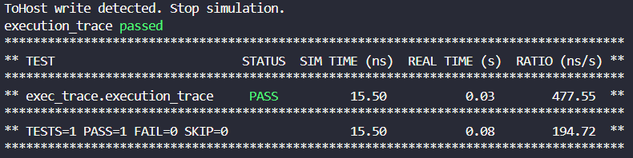

# NTV Example

This example contains all the necessary files and commands to execute a test in the tinyriscv processor.

## Files List

 ### `tinyriscv.mk`
 This Cocotb makefile that contains the chosen simulator, the source files, compiler arguments and the top-level module. There is also an `export TWO_MEMORIES` flag used by the testbench to select between the single-port or dual-port Python memory models.

  > **Note:**
 The `SIMULATION` flag must be turned on to skip the compilation of the `Controller` module in the wrapper.

> **Note:**
 Absolute paths work better when creating these Makefiles, as you may call the routine from different places.

 ### `tinyriscv_reg_file.json`
 This file has information about the register file monitoring. It contains the arrays that may represent the register file (in this case there is only one, correct, candidate) and also the register file interface signals. ---> One the monitoring modes can be chosen, using the `ARRAY_AVAILABLE` flag. <--- MAY NEED UPDATE <---
 >**Note:**
 The contents are Cocotb paths to the signals, as showed by the [dir() function](https://docs.cocotb.org/en/stable/writing_testbenches.html#finding-elements-in-the-design).

### `tinriscv.sv`
This interface wrapper is responsible for translating the tinyriscv custom interface to the standard Wishbone interface. It contains:
1. The top-level Wishbone interface;
2. Configuration flags `ENABLE_SECOND_MEMORY` and `PIPELINED_WISHBONE`. Tinyriscv does have two memory ports but does not implement Pipelined Wishbone.
3. The instantiation of the tinyriscv core with the **mandatory** `Processor` identifier;
4. `assign` sentences to tie some signals to constants and make the protocol adhere to Wishbone standards;
5. [optional] adapter modules to translate from other protocols such as AXI and AHB to Wishbone (not present in this example).

 > **Note:**
 The `Processor` identifier for the instantiation and the correct Wishbone interface naming is necessary for the `exec_trace.py` testbench to identify the path to the signals. The names are hardcoded.

### `tiny_riscv_protocol.json`

---> I'm planning to add a new configuration file for the `RIGHT_JUSTIFIED` and `REGFILE_ARRAY_AVAILABLE` flags. Maybe put Two memories and right justified here, while put reg_file_available in the reg_file.json <---

### `sanity_check.s`

This is a simple test program to check whether the testbench was correctly set up. The routine simply writes to the `tohost` address and terminates the simulation.

Compile the program for RV32I, let the start address to be 0x0 and set the tohost section to 0x1000:

```bash
riscv32-unknown-elf-gcc -Ttext=0x0 -Wl,--section-start=.tohost=0x1000 -Wl,--section-start=.fromhost=0x2000 -march=rv32i -nostdlib -nostartfiles -mabi=ilp32 -o sanity_check.elf sanity_check.s
```


### Tinyriscv Repository

There is a copy of the processor's repository. It is used as is, without any changes.

## Executing


### Dependencies

The first step is to install Cocotb and the Pyelftools libraries. Remember to create a virtual environment

```bash
$ python3 -m venv venv
$ source venv/bin/activate
$ pip install cocotb==1.9.2 pyelftools==0.32
```

> **Important:**
NTV uses Cocotb version 1.9.2 and may be incompatible with version 2.0 or later.

### Reference Trace

You create the reference trace using the modified Spike in the processor_ci_verification repository. The only difference between this Spike version (my commit was in October 2025) and the standard is that it allows execution of programs starting at 0x0.

> **Note:**
To install the modified Spike, just follow the standard steps in the `riscv-isa-sim` repository README and point to the desired installation path using `--prefix=`.

Run the trace generation command:

```bash
$ python3 processor_ci_verification/spike_trace.py -e processor_ci_verification/example/sanity_check.elf -o processor_ci_verification/example
```

Two files will be generated:

- `sanity_check.trace` is the raw trace output from spike, for debugging purposes.

- `sanity_check.spike.json` is the filtered and reformatted trace used by NTV.

### Design Under Test Trace

Now, the execution of the DUT requires the correct use of all the files in the file list. Double check all your files, with special attention to the Makefile's Verilog paths, as they will probably require alterations. Run the following command:

```bash
$ python3 processor_ci_verification/exec_trace.py -m processor_ci_verification/example/tinyriscv.mk -e processor_ci_verification/example/sanity_check.elf -r processor_ci_verification/example/tinyriscv_reg_file.json -o processor_ci_verification/example -v
```

At the end of execution, you will probably see this in the terminal, indicating a successful simulation:



> **Note:**
The *PASS* word in green does not mean the processor passed the sanity_check test, it just means the Cocotb simulation executed successfully and generated the trace.

After executing, you will obtain a file named `sanity_check.fragmented.json`. This file contains the trace events (fetches, register file commits and memory writes) in separate Python lists.

### Comparing the traces

To compare the traces, the comparator will use both the `sanity_check.fragmented.json` and the `sanity_check.spike.json` files.

Run the command:

```bash
python3 processor_ci_verification/compare_traces.py -s processor_ci_verification/example/sanity_check.spike.json -d processor_ci_verification/example/sanity_check.fragmented.json -o processor_ci_verification/example
```

In the terminal, you will likely see:
```
No mismatches found for sanity_check
```

And a merged trace, `sanity_check.final.json` will be created, representing the assumed execution of the DUT.

## Automation
